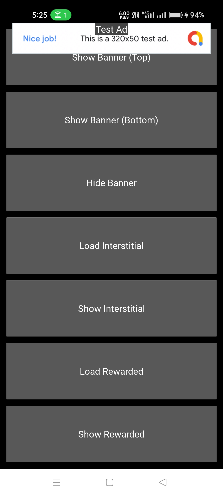
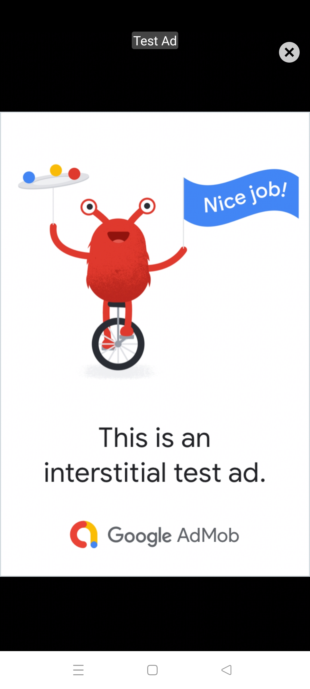

# AdMob4Kivy
## Author

**Sahil Pixel**  
📧 [GitHub](https://github.com/sahil-pixel)


AdMob4Kivy is a lightweight AdMob integration layer for Kivy on iOS/Android apps. It supports banner ads, interstitial ads, and rewarded ads with full Java-to-Python callback support.

## Features

- ✅ Banner Ads (Top or Bottom)
- ✅ Interstitial Ads
- ✅ Rewarded Ads with reward callback
- ✅ Event listener to receive ad status in Python
---


## Python Usage

### 1. Import and Initialize

```python
from admob4kivy import AdmobManager

admob = AdmobManager(callback=ad_event_callback)
```

### 2. Load and Show Ads

```python
# Banner
admob.load_banner(top=True)
admob.show_banner()
admob.hide_banner()

# Interstitial
admob.load_interstitial()
admob.show_interstitial()

# Rewarded
admob.load_rewarded()
admob.show_rewarded()
```

### 3. Listen for Ad Events

```python
def ad_event_callback(event, *args):
    print(f"[AdEvent] {event}: {args}")
```

#### Possible events:

- `ad_loaded`
- `ad_failed`
- `ad_opened`
- `ad_closed`
- `reward_earned`

---


## Google Test Ad IDs

Use these IDs for testing:

```python
class TestIDs:
    APP = "ca-app-pub-3940256099942544~3347511713"
    BANNER = "ca-app-pub-3940256099942544/6300978111"
    INTERSTITIAL = "ca-app-pub-3940256099942544/1033173712"
    REWARDED = "ca-app-pub-3940256099942544/5224354917"
```

---

## 📷 Screenshot

Here's what the app looks like on Android:
<p align="center">
  
  
  
</p>

[![Watch the video]](https://youtube.com/shorts/OCOthpdm24s?si=56coR5SZQ2SYFX1N)

## Example Kivy App


```python
from kivy.app import App
from kivy.lang import Builder
from kivy.uix.boxlayout import BoxLayout
from admob4kivy import AdmobManager,TestIDs

KV = '''
<AdTestUI>:
    orientation: 'vertical'
    spacing: dp(10)
    padding: dp(10)

    Button:
        text: "Show Banner (Top)"
        on_press: app.load_banner(True)

    Button:
        text: "Show Banner (Bottom)"
        on_press: app.load_banner(False)

    Button:
        text: "Hide Banner"
        on_press: app.hide_banner()

    Button:
        text: "Load Interstitial"
        on_press: app.load_interstitial()

    Button:
        text: "Show Interstitial"
        on_press: app.show_interstitial()

    Button:
        text: "Load Rewarded"
        on_press: app.load_rewarded()

    Button:
        text: "Show Rewarded"
        on_press: app.show_rewarded()
'''

class AdTestUI(BoxLayout):
    def __init__(self, **kwargs):
        super().__init__(**kwargs)
        

    

class AdmobKivyApp(App):
    def build(self):
        Builder.load_string(KV)
        self.admob = AdmobManager(callback=self.ad_event_callback)
        return AdTestUI()

    def load_banner(self, top=True):
        self.admob.load_banner(TestIDs.BANNER, top=top)

    def hide_banner(self):
        self.admob.hide_banner()

    def load_interstitial(self):
        self.admob.load_interstitial(TestIDs.INTERSTITIAL)

    def show_interstitial(self):
        self.admob.show_interstitial()

    def load_rewarded(self):
        self.admob.load_rewarded(TestIDs.REWARDED)

    def show_rewarded(self):
        self.admob.show_rewarded()

    def ad_event_callback(self, event, *args):
        print(f"[AdEvent in Kivy APP ] {event}: {args}")


if __name__ == "__main__":
    AdmobKivyApp().run()

```


## Pay for Support

If you find this project helpful and want to support development, you can donate for support:

-  [](https://ko-fi.com/sahilpixel)
  
- [](https://paypal.me/SKSAHILIN?country.x=IN&locale.x=en_GB)


Thank you for your support!
---

## License

MIT License
